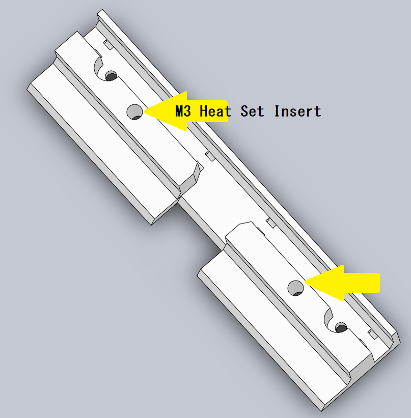
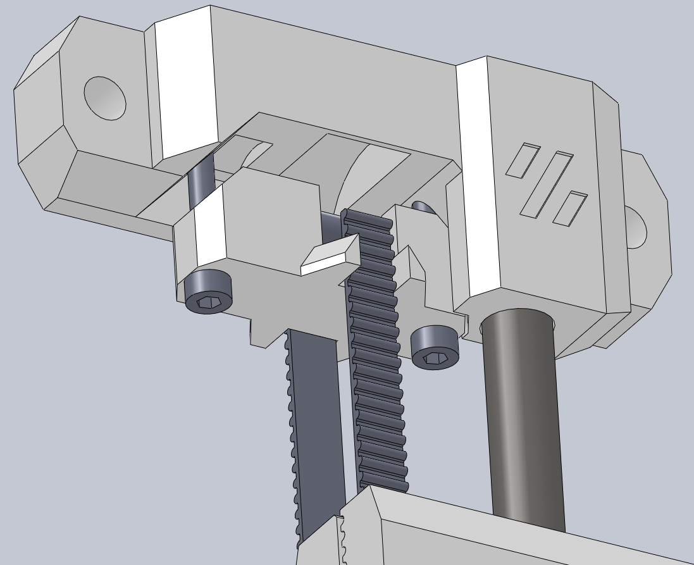

⬅ back to [Main Page](README.md)

__Table of contents__
- [01 Printing](#01-Printing)
- [02 modification AB-Gantry](#02-modification-AB-Gantry)
- [03 beldholder down](#03-beldholder-down)
- [04 counterweight](#04-counterweight)
- [05 beldholder up](#05-beldholder-up)
- [06 hang and tension](#06-hang-and-tension)

> [!WARNING]
> The instructions refer to converting a built Voron, with a Can-Bus Toolhead. 
> Because the Z-cable chain needs to be replaced with the thinner ones. 
> Don't be surprised, the pictures are still old, the STL files are newer and correct. 

# 01 Printing
Printing the Parts with the normal settings of the Voron build.
- Material: ABS
- Layer heigh: 0.2mm
- Extrusion width: 0.4
- Infill: Grid, Gyroid, Honeycomb, Triangle or Cubic
- Infill Percentage: Recommended: 40%
- Wall Count: Recommended: 4
- Solide Top/Bottom Layer: Recommended: 5

# 02 modification AB-Gantry
&uarr; [back to top](#top) 

* For better assembly, move or push the gantry approximately 2/3 upwards. 
* Completely remove the existing Z chain. 
* Insert 2x M3 Heat Set Inserts for the cable chain attachment into the "beldholder_flexible_button_cable_drag". 

 

_(The image is without AB_Drive_Units, it starts where the profile ends.)_
 

 

  

* Attach the button parts with stops to the original "AB_Drive_Units". 
* To do this, place M3 and M5 T-slots in the aluminum profile. 
* And fasten with the M3 screws provided. 
* cut the down belts to 506mm leng.
* cut the up belts to 470mm leng.
* Then attach the timing belts to the holders with the M5x16 screws. 
* Fill the cables with the narrower cable tow that you have from the X or Y tow, for example, as the Z tow. (Reason: The original Z-cable tow is wider than the aluminum profile) 

* Attach the cable tow to the top with the bracket. 
* Please note that the cable for the left motor branches off into the aluminum profile before it is attached. 

* Attention, the motor cable of the left motor is tight. 

# 03 beldholder down
&uarr; [back to top](#top) 

 

 

  
* Insert M3 Heat Set Inserts 
* Please do the same on the left side as on the right side. 
 

* Place the "T-Nut_Tool" on the aluminum profile and insert the T-Nut.   The side of the label is the side where the thread is located. 
* remove the "T-Nut_Tool" 
* bring the printparts to the aluminum profile 
 
  

* insert the screws into the holes provided on the T-nut. But only tighten the screws loosely. 
 
  
  
* Lay the cables for the tow as shown.   
* And do not tighten the cable ties completely.   The cable should still be able to move back and forth.   The cable ties are initially used to ensure that no cables are crushed.  
* Cut off the ends of the cable ties.   
 
  

* Set up the "cable_towing_support" 
* align all parts and tighten the screws for the "cable_towing_support" first 
* then attach all screws through the holes to the T-slot nuts 
* Attach the cable trailing end to the support.

# 04 counterweight
&uarr; [back to top](#top) 

  
  
* Pierce the holes in the support with the M8 screws. 
* Insert 6x M10 nuts into each screw and then tighten with the M8 nut. (But be careful, it's just plastic.) 
* Put as much weight as you think of. (I currently have 8 screws in it.)  
* insert the 2 longitudinal bearings into the recess. 
* also put the 2 fits behind it. 

 
 

 

Don't forget to attach the M3 Heat Set Inserts to the bottom for the lid.

# 05 beldholder up
&uarr; [back to top](#top) 

  
coming soon...

# 06 hang and tension
&uarr; [back to top](#top) 
coming soon...  

⬅ back to [Main Page](README.md)
