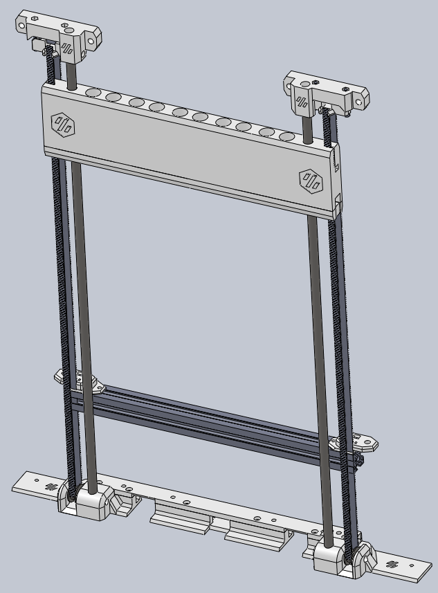
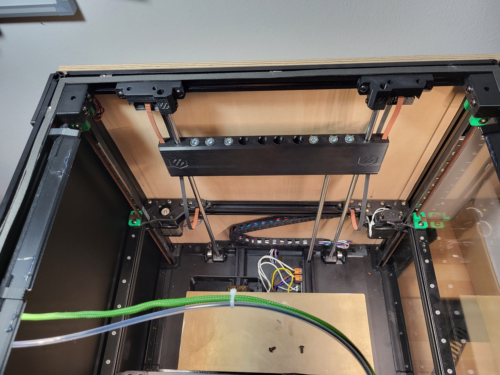

> [!CAUTION]
> # Danger! Alpha status! 
 

This project introduces a counterweight system designed specifically for the rear section of a Voron 2.4 350 3D printer. The primary objective of this system is to mitigate the load stress on the gantry, especially during rapid Z-axis deceleration. This not only helps in reducing the strain but also prevents the gantry from sagging. However, it's important to note that this modification might result in increased torque during acceleration.

> [!WARNING]
> **Currently, only the upper suspension is functional.**

The current state of the project focuses on enhancing the functionality of the upper suspension system. Although the primary mechanism is operational, there is an inefficiency in the way the counterweight engages during a fall, which needs attention.

Key components still under development include:

-   A comprehensive list of required print parts.
-   Visual documentation through photographs.
-   Detailed assembly instructions.

For successful implementation of this modification, it is essential that the Z-axis drag chain be positioned within the gantry's shadow. Additionally, this mod requires replacing the broader cable drag chain with a more compact version, typically used in the X/Y axes.

As of now, this project is exclusively compatible with the Voron 2.4 350 model. Further adaptations and refinements are in progress to broaden its applicability.

  
The weight is intentionally relaxed in the picture.
The lower strap is not mounted.

### Required Hardware: 
* List of Hardware: [BOM](/BOM.md)

### Build guide: 
* [Build](/Build.md)

 
 
 
Special Thanks to: 
spitzbirne32
