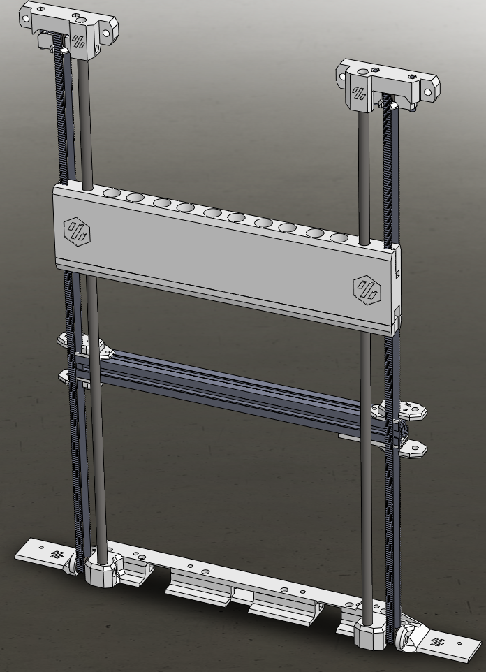
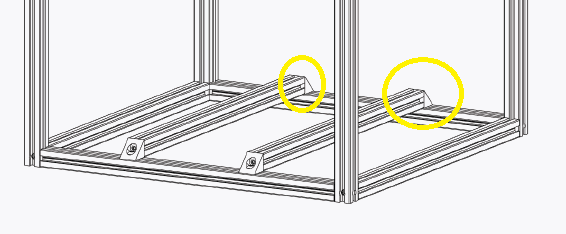
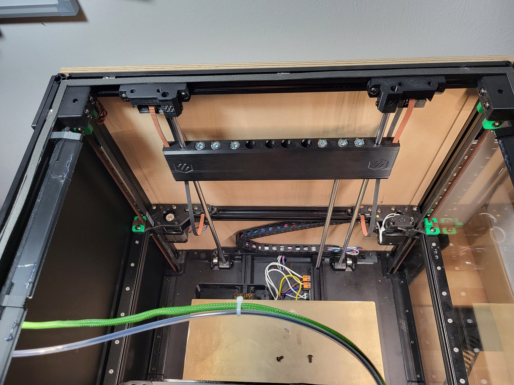
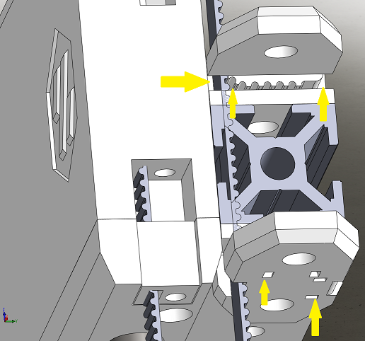

The project is currently intended exclusively for __Voron 2.4 350mm__.  
The counterweight relieves the load on the rear Z stepper motors. 
Possible sagging of the gantry is also reduced. 

The disadvantage is that the acceleration force and braking force are increased. 
 
 

> [!WARNING]
> I noticed that during input shaping the vibrations start to rattle due to the play in the counterweight bearing.
> Still looking for a solution to the problem.

 
 
 
 

> [!WARNING]
> __The project is not yet fully completed.__  
> - the building instructions are work-in-progess.  
> - some pictures are still old versions.  

> [!IMPORTANT]
> The __Z-cable chain__ must/should be exchanged for one of the narrower __X or Y cable chain__.

> [!IMPORTANT]
>   
> The __corner brackets__ should also be attached to the ends of the heated bed bracket on the frame.

### Required Hardware: 
* List of Hardware: [BOM](/BOM.md)

### Build guide: 
* [Build](/Build.md)

  
_The weight is intentionally relaxed in the picture.
The lower strap is not mounted._

# Changelog

* 10.02.22024: modified the belt tension on  the gantry side. It wasn't aligned with the timing belts.   also added cable tie holders for timing belts and cables.  
   
 
 

# Special Thanks to
__spitzbirne32__
